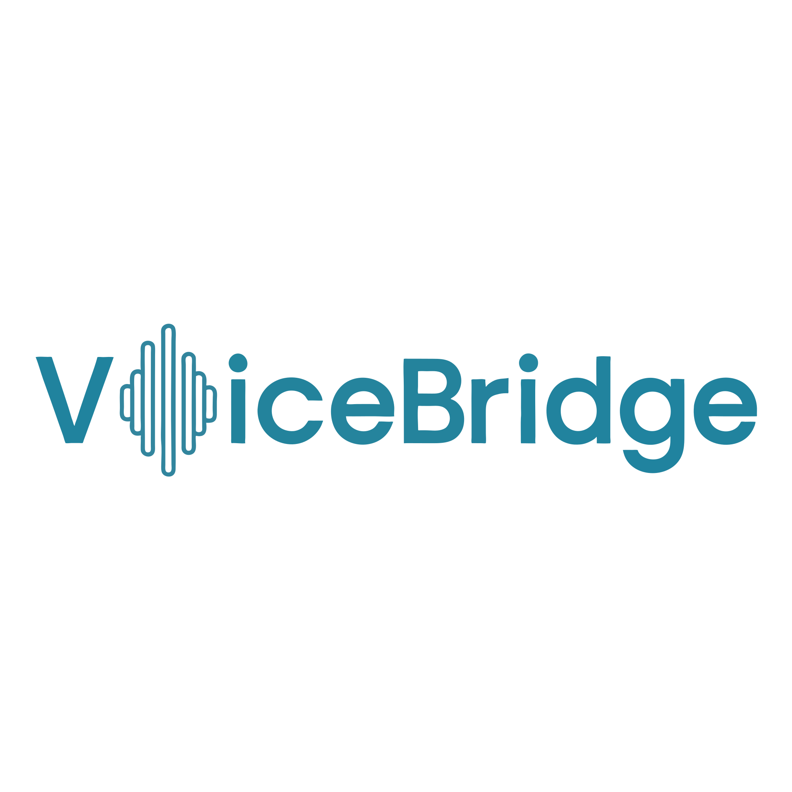

# **VoiceBridge**

  

VoiceBridge is an accessibility interface that helps individuals with dysarthric or atypical speech interact with technology using ASR. The system converts speech to text, confirms user intent, and executes browser/device commands to support independent, hands-free use.

---

## **Project Logistics**

- **Date of project start:** 2025-09-02
- **Team Name:** _Speech Buddies_
- **Developer Names:**
  - Kelvin Yu
  - Luna Aljammal
  - Mazen Youssef
  - Rawan Mahdi

---

## **Project Structure**

The folders and files for this project are as follows:

    .
    ├── docs        # Project documentation (SRS, Hazard Analysis, etc.)
    ├── refs        # Reference materials and research sources
    ├── src         # Core system code
    └── test        #  Tests for components
